-   [Summary of packages and data set](#summary-of-packages-and-data-set)
    -   [Libraries and scripts required](#libraries-and-scripts-required)
    -   [Summary of patient single cell data](#summary-of-patient-single-cell-data)
    -   [Clinical data](#clinical-data)
-   [Introducing the image data](#introducing-the-image-data)
-   ["Bulk tumor" analysis](#bulk-tumor-analysis)
    -   [Association with patient response to treatment](#association-with-patient-response-to-treatment)
    -   [Association with metastasis](#association-with-metastasis)
    -   [Differences in samples after therapy](#differences-in-samples-after-therapy)
-   [Single cell analysis: association between different markers](#single-cell-analysis-association-between-different-markers)
-   [Single cell analysis: Unsupervised clustering of primary samples](#single-cell-analysis-unsupervised-clustering-of-primary-samples)
    -   [Clustering based on Phenotype (ER/HER2 subpopulations)](#clustering-based-on-phenotype-erher2-subpopulations)
        -   [Clustering based on Genotype (Her2 amplification)](#clustering-based-on-genotype-her2-amplification)
        -   [Combined pheno-genotype](#combined-pheno-genotype)
-   [Associations between clusters and clinical parameters](#associations-between-clusters-and-clinical-parameters)
    -   [Association between genetic and phenotype clusters](#association-between-genetic-and-phenotype-clusters)
    -   [Associations with other clinical variables](#associations-with-other-clinical-variables)
-   [Patient survival data](#patient-survival-data)
    -   [Clusters and Breast Cancer Specific Death](#clusters-and-breast-cancer-specific-death)
    -   [Clusters and Disease Progression (Metastasis)](#clusters-and-disease-progression-metastasis)
    -   [OS based on ER status](#os-based-on-er-status)
-   [Amplicon type](#amplicon-type)
    -   [Distributions in primary and relapsed samples](#distributions-in-primary-and-relapsed-samples)
    -   [Association with other clinical variables](#association-with-other-clinical-variables)
    -   [Effect on survival](#effect-on-survival)
-   [Evolutionary trajectory with treatment](#evolutionary-trajectory-with-treatment)
    -   [Kullback Leibler index](#kullback-leibler-index)
    -   [Genotype changes](#genotype-changes)
    -   [Phenotype changes](#phenotype-changes)
    -   [Geno-Phenotype changes](#geno-phenotype-changes)
    -   [KM curves based on genotype or phenotype changes](#km-curves-based-on-genotype-or-phenotype-changes)
    -   [Associating differences in KL with other clinicopathological parameters](#associating-differences-in-kl-with-other-clinicopathological-parameters)
-   [Trajectory for metastatic samples:](#trajectory-for-metastatic-samples)
    -   [Patient 7435](#patient-7435)
    -   [Patient 7360](#patient-7360)
-   [R Session Info](#r-session-info)

This document summarises the data obtained and code required to reproduce the analysis from **"Intra-tumor heterogeneity defines treatment-resistant HER2+ breast tumors"**

Summary of packages and data set
================================

Libraries and scripts required
------------------------------

Below are the packages used and scripted functions required.

``` r
# packages
library(ggplot2)
library(gplots)
library(RColorBrewer)
library(reshape2)
library(plyr)
library(gclus)
library(foreach)
library(doParallel)
library(survival)
library(ggrepel)
library(plotrix)
library(survminer)
ggPlotSurv=function(fit, data,title, pal){
library(survminer)
ggsurvplot(fit, data, risk.table = T,pval=T, linetype = 1, palette = pal, ggtheme = theme(panel.grid.major = element_blank(), panel.background = element_blank(), axis.line = element_line(colour = "black")), title=title, break.time.by = 10, font.tickslab = 10, pval.size=4, fontsize=3, pval.method = T
)
}

source("scripts/clustermap.R")
source("scripts/readFiles.R")
source("scripts/DiversityFunctions.R")
RedBu=brewer.pal(11, "RdBu")
```

Summary of patient single cell data
-----------------------------------

Single cell data obtained from tissue sections are summarised in the directories: <tt> "data/PreSurgerySamples", "data/PostSurgerySamples", "data/MetSamples"</tt>.

Below is a summary of the patient cohort, with the number of samples obtained for each patient stored in the variable <tt>PatTab</tt>. This table is shown in \*\* Supplementary Table 2\*\*

    ##      Patient Prim.Region Prim.N Surg.Regions Surg.N Met.Regions Met.N
    ## 0013    0013           1      1            2      2           0     0
    ## 0040    0040           1      1            1      1           0     0
    ## 0048    0048           1      1            1      1           0     0
    ## 0053    0053           1      1            0      0           0     0
    ## 0069    0069           1      1            1      1           0     0
    ## 6178    6178           1      1            0      0           0     0
    ## 6361    6361           2      4            0      0           0     0
    ## 6370    6370           1      1            1      2           0     0
    ## 6410    6410           1      2            2      3           0     0
    ## 6450    6450           1      1            1      1           0     0
    ## 6739    6739           2      3            0      0           0     0
    ## 6748    6748           1      2            1      1           0     0
    ## 6930    6930           1      1            0      0           1     1
    ## 7126    7126           1      1            0      0           0     0
    ## 7334    7334           1      1            0      0           0     0
    ## 7347    7347           1      1            0      0           0     0
    ## 7350    7350           1      2            1      3           0     0
    ## 7360    7360           1      1            2      2           1     1
    ## 7362    7362           1      1            1      4           0     0
    ## 7363    7363           1      1            1      1           0     0
    ## 7364    7364           1      1            0      0           0     0
    ## 7370    7370           2      2            1      1           0     0
    ## 7374    7374           1      1            1      3           0     0
    ## 7379    7379           1      2            1      1           0     0
    ## 7406    7406           2      3            2      5           0     0
    ## 7417    7417           1      1            0      0           0     0
    ## 7424    7424           2      6            1      2           0     0
    ## 7428    7428           1      1            1      2           0     0
    ## 7435    7435           1      2            1      2           1     2
    ## 7441    7441           1      1            1      1           0     0
    ## 7457    7457           1      1            0      0           0     0
    ## 7556    7556           1      1            0      0           0     0
    ## 7560    7560           1      4            1      1           0     0
    ## 7563    7563           1      1            1      4           0     0
    ## 7588    7588           1      1            1      1           0     0
    ## 7619    7619           1      1            1      1           0     0
    ## 7641    7641           2      3            0      0           0     0

Below is a summary of the number of tumour cells counted for each patient sample (stored in <tt> df.New37</tt>). This table is included in **Supplementary Table 2**

    ##       
    ##         Pre Post  Met
    ##   0013  188  507    0
    ##   0040  154   64    0
    ##   0048   58   11    0
    ##   0053  317    0    0
    ##   0069  154   97    0
    ##   6178   67    0    0
    ##   6361  858    0    0
    ##   6370  139  180    0
    ##   6410   98   26    0
    ##   6450  463   30    0
    ##   6739  134    0    0
    ##   6748  693  244    0
    ##   6930  313    0  436
    ##   7126  238    0    0
    ##   7334   28    0    0
    ##   7347  193    0    0
    ##   7350   90  116    0
    ##   7360   67  194  154
    ##   7362  355   91    0
    ##   7363  385   24    0
    ##   7364  218    0    0
    ##   7370  198  100    0
    ##   7374   87   74    0
    ##   7379  221  174    0
    ##   7406   92   77    0
    ##   7417   14    0    0
    ##   7424  202  106    0
    ##   7428  139   74    0
    ##   7435 1043  626  142
    ##   7441  467   40    0
    ##   7457  221    0    0
    ##   7556  145    0    0
    ##   7560  144   22    0
    ##   7563  154  158    0
    ##   7588  155  232    0
    ##   7619  245  174    0
    ##   7641  576    0    0

Clinical data
-------------

Clinical data including grade, stage, histology and treatment regime is stored in <tt> PatClin</tt> and is shown in **Supplementary Table 1**

Introducing the image data
==========================

For each image, we capture the staining intensity and shape parameters as well as locational information for every tumor cell following analysis in <tt> GoIFISH</tt>.

Cells are discretised as negative or positive for different markers based on the following cut-offs: \* ER: 50 \* HER2 membrane: 300 \* Her2 (and Cep17) CN: 63, 200 (pixel area) for normal, gain and high level amplifications.

These cutoffs were derived from **Trinh et al, Genome Biology 2014**.

An example image is patient 7588. We can show the location of different cell types in the pre-treatment biopsy and the post-treatment biopsy, as shown in **Figure 1:E,F**

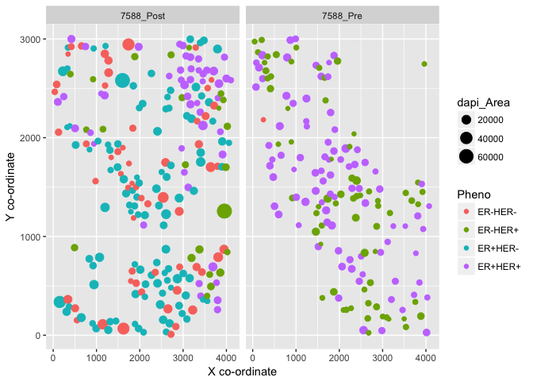

As we can see, the cellular population shifts from a mixture of HER2+ (both ER+ and ER-) to primarily ER+ and HER2- population. The cell size also increases, as shown by <tt> dapi Area</tt>.

We can also summarise the cellular distribution across all biopsies at a given time point (i.e. a patient may have two pre-treatment biopsies) based on markers of interest, as shown below (and in **Figure 1G**): We see that the pre-surgery samples have a much higher HER2 intensity and higher Her2 CN. In comparison, the post-surgery samples have lost cells with high Her2CN and are more phenotypically diverse.

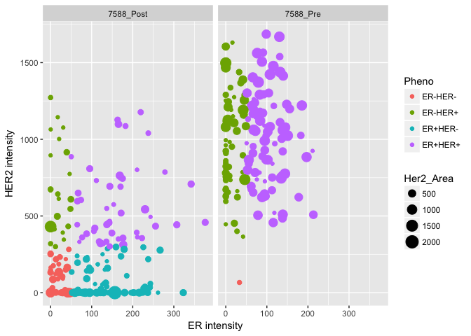

These types of plots are shown for all patients before and after surgery in **Supplemental Figure 3** (looking at HER2 and ER co-expression) and **Supplemental Figure 4** (HER2 and HerCN co-expression).

"Bulk tumor" analysis
=====================

For each patient, we computed one summary output for each feature (eg. HER2 protein expression, cent 17 copy number) which was the mean value across all tumor cells in all images of primary samples. Here, we sought to determine whether this summary statistic could be predictive of (i) patient outcome to (anti-HER2) treatment **Supplemental Figure 2A** or (ii) metastasis **Figure 2A**

Association with patient response to treatment
----------------------------------------------

Look at our main variables of interest: HER2 membrane intensity, Her2 CN, ER intensity and CEP17. Do any of these associate with complete response (pathological complete response, pCR) to therapy?

    ## Using Pat as id variables

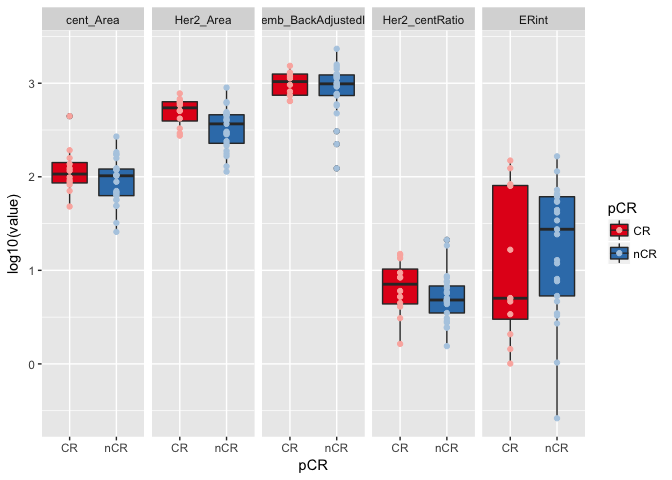

What are the number of patients who have pathological complete response (pCR) compared to non-complete response (nCR)?

    ##  CR nCR 
    ##  12  25

Are any of the above differences significant using a t test?

    ##            cent_Area            Her2_Area memb_BackAdjustedInt 
    ##           0.28636257           0.01571877           0.79484830 
    ##       Her2_centRatio                ERint 
    ##           0.30391133           0.92656868

Differences in Her2 area (CN) are significantly different between pCR and nCR, where pCR appear to have higher counts, as shown in **Supplemental Figure 2A**

Association with metastasis
---------------------------

Perform the same analysis looking at metastasis instead of treatment response:

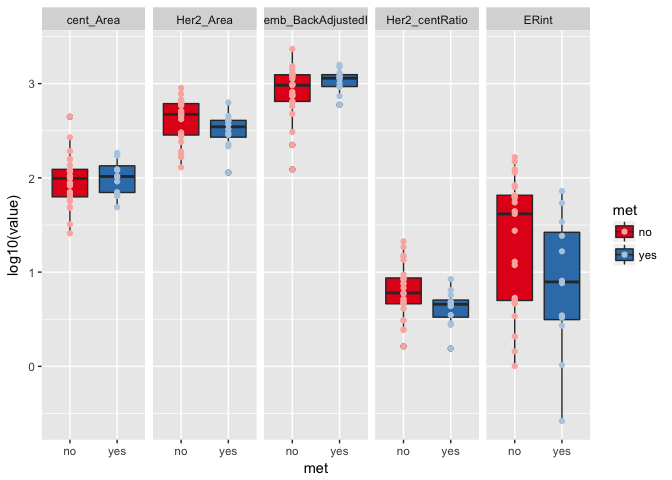

Summary of patient outcome:

    ##  no yes 
    ##  25  12

Test for significance:

    ##            cent_Area            Her2_Area memb_BackAdjustedInt 
    ##           0.83932843           0.06617362           0.20178051 
    ##       Her2_centRatio                ERint 
    ##           0.00938631           0.02111174

Differences: lower ER expression, lower Her2/cent ratio and perhaps lower Her2 CN is associated with metastasis. Despite the difference in Her2 CN, there appears to be no effect on HER2 expression (**Figure 2A**).

Differences in samples after therapy
------------------------------------

We can do the same analysis looking at differences between samples before and after therapy (**Suppplementary Figure 7**): Here we are focused on changes that happens before and after therapy, and thus remove samples which have pathological complete response.

    ## Using Pat, type as id variables


Test for significance:

    ##            cent_Area            Her2_Area memb_BackAdjustedInt 
    ##            0.2450617            0.7213652            0.2296924 
    ##       Her2_centRatio                ERint 
    ##            0.5414166            0.5575849

Single cell analysis: association between different markers
===========================================================

We can determine whether there are relationships between different markers of interest before and after therapy. This can be used to answer questions such as does HER2 protein increase with HER2 copy number?

We can illustrate this for patient 7588, as shown in **Supplemental Figure 3 and 4**

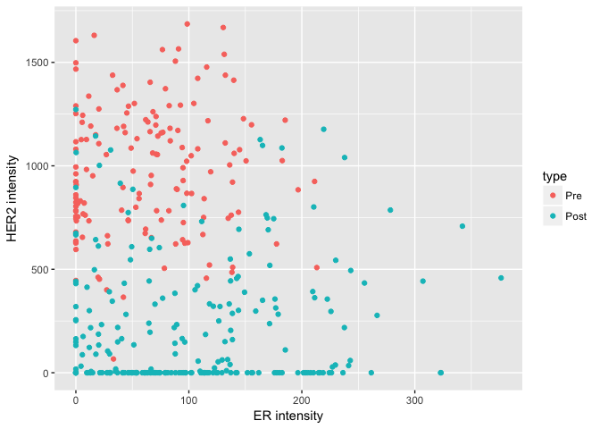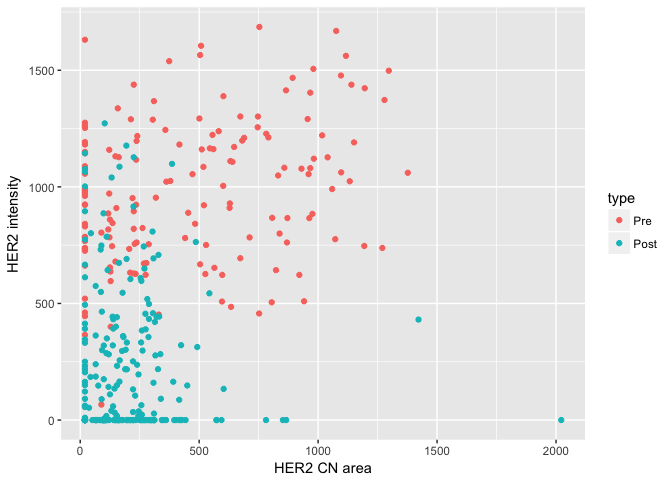

we can also compute the correlation between these features in both the primary and the post-treatment sample:

    ## [1] "Comparing ER and HER2:"

    ## [1] "pre surgery"

    ## 
    ##  Spearman's rank correlation rho
    ## 
    ## data:  Pat7588$nucl_NucAdjustedInt[Pat7588$type == "Pre"] and Pat7588$memb_BackAdjustedInt[Pat7588$type == "Pre"]
    ## S = 559070, p-value = 0.2196
    ## alternative hypothesis: true rho is not equal to 0
    ## sample estimates:
    ##        rho 
    ## 0.09917028

    ## [1] "post surgery"

    ## 
    ##  Spearman's rank correlation rho
    ## 
    ## data:  Pat7588$nucl_NucAdjustedInt[Pat7588$type == "Post"] and Pat7588$memb_BackAdjustedInt[Pat7588$type == "Post"]
    ## S = 1905300, p-value = 0.1997
    ## alternative hypothesis: true rho is not equal to 0
    ## sample estimates:
    ##        rho 
    ## 0.08450902

    ## [1] "Comparing HER2 protein and gene:"

    ## [1] "pre surgery"

    ## 
    ##  Pearson's product-moment correlation
    ## 
    ## data:  Pat7588$Her2_Area[Pat7588$type == "Pre"] and Pat7588$memb_BackAdjustedInt[Pat7588$type == "Pre"]
    ## t = 3.9747, df = 153, p-value = 0.0001083
    ## alternative hypothesis: true correlation is not equal to 0
    ## 95 percent confidence interval:
    ##  0.1557977 0.4422505
    ## sample estimates:
    ##       cor 
    ## 0.3059319

    ## [1] "post surgery"

    ## 
    ##  Pearson's product-moment correlation
    ## 
    ## data:  Pat7588$Her2_Area[Pat7588$type == "Post"] and Pat7588$memb_BackAdjustedInt[Pat7588$type == "Post"]
    ## t = -0.84024, df = 230, p-value = 0.4016
    ## alternative hypothesis: true correlation is not equal to 0
    ## 95 percent confidence interval:
    ##  -0.18281537  0.07400671
    ## sample estimates:
    ##         cor 
    ## -0.05531927

There appears to be an association between HER2CN and expression in the pre-surgery samples, but not the post surgery samples

We can repeat this for the entire cohort to determine which cases have a correlation:

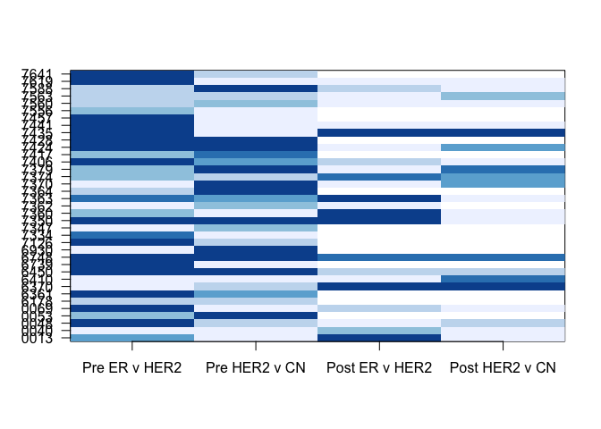

Dark blue indicates significant correlation between two parameters of interest, and white indicate no correlation by spearman correlation.

Single cell analysis: Unsupervised clustering of primary samples
================================================================

Using the measurements attained at the single cell level, we can classify cells into different groups according to their ER, HER2 and Her2 (CN) status. For each patient, we can determine the cellular fraction of each cellular subtype (eg. 90% HER2+,ER-, 7% HER2-ER-,3% HER2+ER+ 0% HER2-ER-) and determine which patients are similar and different from each other:

Clustering based on Phenotype (ER/HER2 subpopulations)
------------------------------------------------------

Here, we see three main groups: P1 is characterised by a large population of HER2+ER+ cells. P2 is mainly HER2+ER- and P3 appears to be more ER-like and excluded from further analysis. Note for some samples, use the ER background adjusted intensity ("0053", "6450", "7363", "7370"). This plot is shown in **Figure 3A**

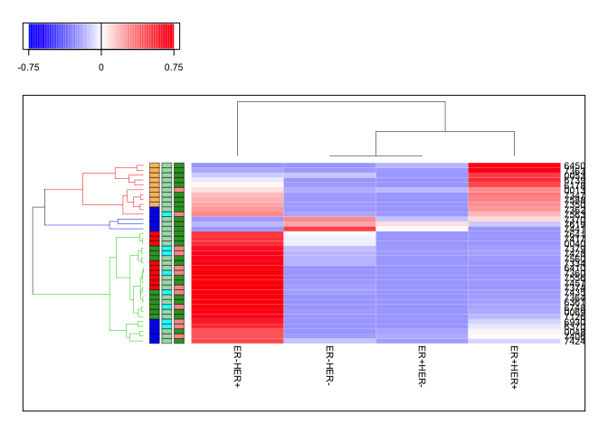

Note that the column side bar has three entries: ER percentage, survival and metastasis

-   Survival: cyan: dead, green:alive
-   Progression: pink: metastasis, green: no metastasis
-   ER status: red &lt;1%, green &lt;10%, blue &lt;50%, orange &gt;50%

The number of cases in each group are:

    ##   P1   P2 NA's 
    ##   11   23    3

Note that P3 have very few patients and are excluded from further analysis

### Clustering based on Genotype (Her2 amplification)

We can also do this on the genomic level. Here, the cut-offs are a pixel are of 63 (equivalent to 3 spots) and 200 (approximately 8-10 spots). Three groups are summarised: normal (less than 3 copies), low level gain (3-10 copies), and high level amplification. This plot is shown in **Figure 4A**

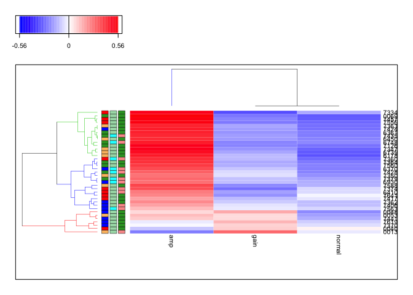

Three clusters are present. G1 appears to dominated by the "gain" population. G2 is at the other extreme and almost all cells have high level amplification. G3 is an intermediate which have a high level of CN amp cells but other classes are also present.

Note that the column side bar has three entries (similar to the phenotype plot): ER percentage, survival and metastasis

-   Survival: cyan: dead, green:alive
-   Progression: pink: metastasis, green: no metastasis
-   ER status: red &lt;1%, green &lt;10%, blue &lt;50%, orange &gt;50%

The number of samples in each cluster are:

    ## G1 G2 G3 
    ##  7 14 16

### Combined pheno-genotype

Perform clustering based on both phenotype and genotype, giving 12 distinct classes (based on 2: ER, 2:HER2, 3: Her2CN). This figure is shown in **Supplementary Figure 5A**

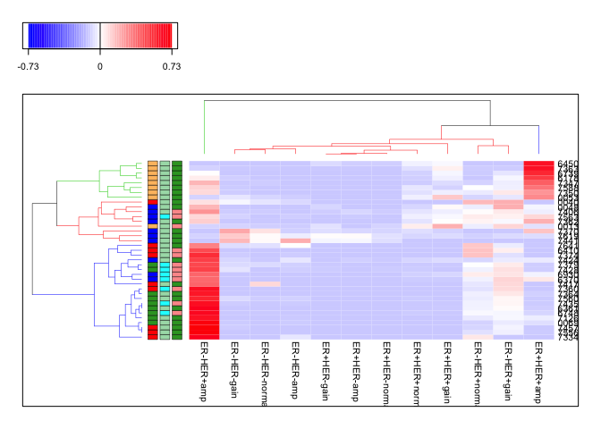

Three main clusters are present: an HER2+ER+amp+ group (PG2), a HER2+ER-amp+ group (PG3) and a highly heterogeneous group (PG1):

The number of samples in each cluster are:

    ## PG1 PG2 PG3 
    ##   9   8  20

Compute Shannon index to see if any specific cluster has a difference in heterogeneity: Compare entropy in the three classes?

Associations between clusters and clinical parameters
=====================================================

Here, we wish to determine whether any of the aforementioned clusters is associated with patient outcome:

Association between genetic and phenotype clusters
--------------------------------------------------

First look at whether there is any associations between the genetic and phenotypic clustering

    ##     
    ##      P1 P2
    ##   G1  2  2
    ##   G2  5  9
    ##   G3  4 12

    ## 
    ##  Pearson's Chi-squared test
    ## 
    ## data:  m1
    ## X-squared = 1.0367, df = 2, p-value = 0.5955

There appears to be an association between the genetic and phenotype clusters, whereby most P2 patients are also G3.

Associations with other clinical variables
------------------------------------------

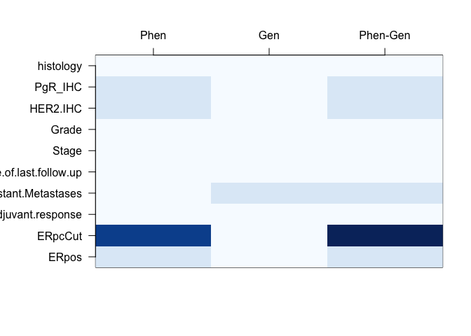

Above is a heatmap of -log10 p values for associations between the clusters and different clinical parameters. The darker the color, the more significant the association by fisher exact test. For example, there is a strong association between the ER clusters, PR and the phenotype or pheno-genotype clusters (which is expected).

Also, there appears to be an association between distant metastasis and HER2 IHC with genotype or geno-phenotype clusters.

    ##                                              Phen        Gen     Phen-Gen
    ## ERpos                                3.008236e-02 0.69103327 6.305082e-02
    ## ERpcCut                              1.564387e-08 0.14795199 1.649637e-09
    ## neoadjuvant.response                 8.391624e-01 0.15001302 9.924545e-02
    ## Distant.Metastases                   2.052535e-01 0.02988089 7.753492e-02
    ## Status.at.the.time.of.last.follow.up 2.930774e-01 0.11643684 1.158272e-01
    ## Stage                                2.842254e-01 0.47860436 7.453227e-01
    ## Grade                                2.457927e-01 0.60586960 3.483437e-01
    ## HER2.IHC                             7.757968e-02 0.13112444 3.699957e-02
    ## PgR_IHC                              5.546929e-02 0.19540131 1.662795e-02
    ## histology                            7.004031e-01 0.78280031 9.096457e-01

Patient survival data
=====================

Here, we sought to determine whether cluster group (P series, G series or PG series) is associated with survival outcome (breast cancer specific death, or metastasis). All risk tables and p values are computed using the <tt> survminer </tt> package. Due to the small number of events (~13 in total), cox proportional hazards models were not used in the following analyses.

Clusters and Breast Cancer Specific Death
-----------------------------------------

These KM curves are shown in **Figures 3C and 4D and Supplemental Figure 5B**

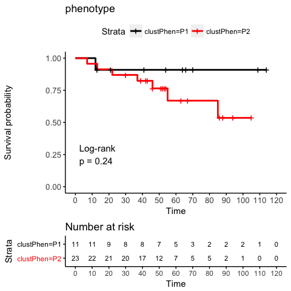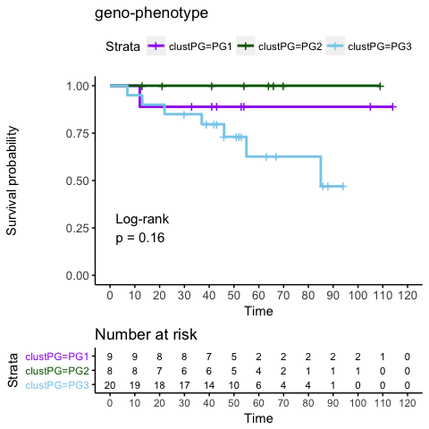

Clusters and Disease Progression (Metastasis)
---------------------------------------------

Instead of overall survival, we can look at time to metastasis. The following plots are included in **Figure 4D, and Supplementary Figure 5C**

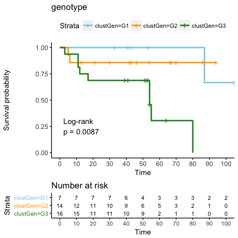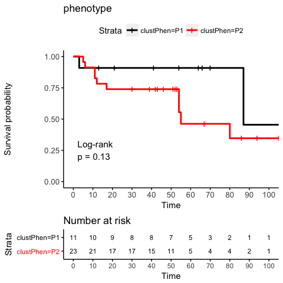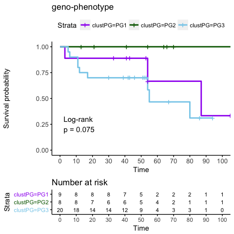

OS based on ER status
---------------------

We can also look at the impact variation in ER expression has on overall survival. This is featured in **Figure 3D**

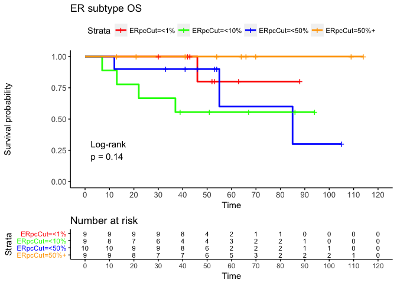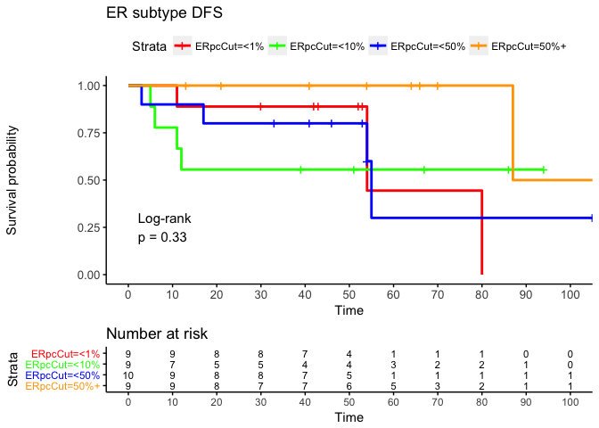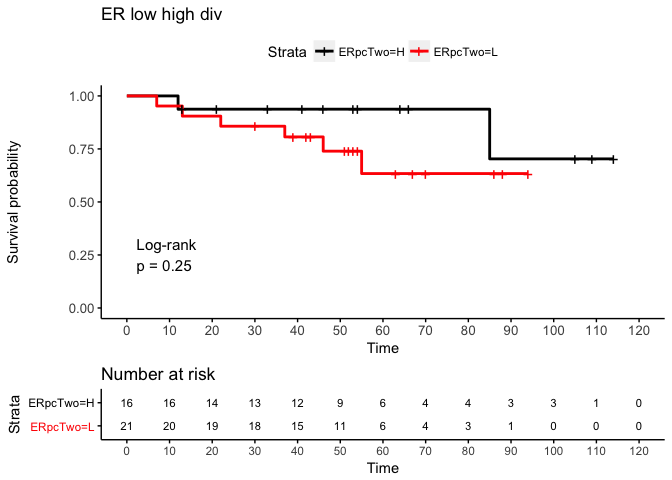

Amplicon type
=============

From manual scoring we have noticed three types of amplicon distributions: (i) scattered where distinct spots are observed throughout the nucleus (ii) clustered where a high intensity large spot is noticed in one or two locations within the nucleus and (iii) mixed: a mixture of the above two.

Distributions in primary and relapsed samples
---------------------------------------------

We can plot the distributions of these different types in a triangle plot, and color code the entries based on their outcome:

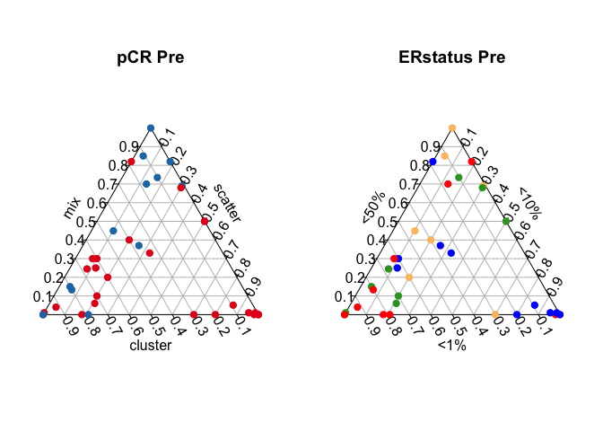

Here we have color coded: \* pCR: black, nCR: red \* ER neg: red, &lt;10%: black, &lt;50% green, 50%+ yellow

Note that almost all scattered samples are non-CR, those which are more "mixed" like appear to do better.

Similarly, ER negative or low ER expressing samples have a clustered phenotype.

We can see how this distribution changes following therapy:

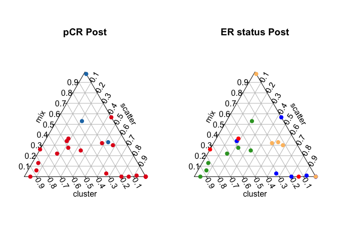

We can also view these distributions with respect to metastasis and ER status (**Supplemental Figure 6:A,B**)

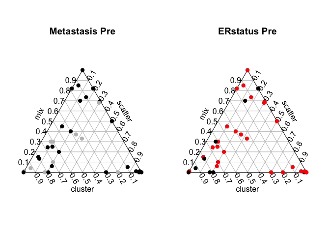

Association with other clinical variables
-----------------------------------------

We can determine whether there is an association with other clinical variables (Eg. ER status or pathological response to treatment) using a chi-sq test:

    ## [1] "association with response to treatment"

    ##      
    ##       cluster het mix scatter
    ##   CR        4   3   5       0
    ##   PR1       3   9   1       7
    ##   PR2       1   1   0       0
    ##   SD        2   0   0       1

    ## 
    ##  Fisher's Exact Test for Count Data
    ## 
    ## data:  tab1
    ## p-value = 0.01143
    ## alternative hypothesis: two.sided

    ## [1] "association with response to treatment"

    ##      
    ##       cluster het mix scatter
    ##   nCR       6  10   1       8
    ##   pCR       4   3   5       0

    ## 
    ##  Fisher's Exact Test for Count Data
    ## 
    ## data:  tab1
    ## p-value = 0.007622
    ## alternative hypothesis: two.sided

    ## [1] "association with ER status"

    ##       
    ##        cluster het mix scatter
    ##   <1%        5   1   2       1
    ##   <10%       5   3   1       0
    ##   <50%       0   4   1       5
    ##   50%+       0   5   2       2

    ## 
    ##  Fisher's Exact Test for Count Data
    ## 
    ## data:  tab1
    ## p-value = 0.007033
    ## alternative hypothesis: two.sided

    ## [1] "association with ER status2"

    ##        
    ##         cluster het mix scatter
    ##   FALSE       5  12   4       7
    ##   TRUE        5   1   2       1

    ## 
    ##  Fisher's Exact Test for Count Data
    ## 
    ## data:  tab1
    ## p-value = 0.08546
    ## alternative hypothesis: two.sided

    ## [1] "association with metastasis"

    ##      
    ##       cluster het mix scatter
    ##   no        5   8   6       6
    ##   yes       5   5   0       2

    ## 
    ##  Fisher's Exact Test for Count Data
    ## 
    ## data:  tab1
    ## p-value = 0.1894
    ## alternative hypothesis: two.sided

Effect on survival
------------------

Does this predict patient outcome?

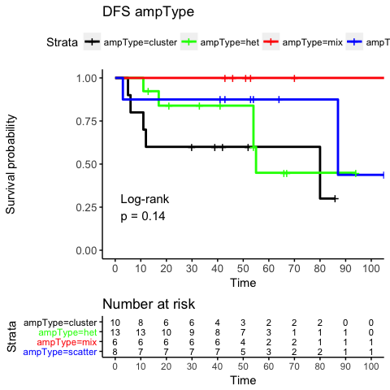

Evolutionary trajectory with treatment
======================================

Kullback Leibler index
----------------------

The Kullback Leibler index computes the differences in distribution between the primary and post-treatment sample. ie. it computes whether the cellular fractions (eg. ER+/HER2+ fractions) is similar or not to the primary sample. Below are histograms showing the KL index reflecting genetic and phenotypic changes in samples before and after therapy

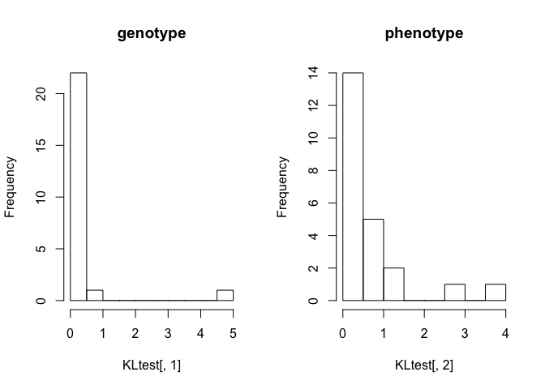

We would like to see whether genotypic or phenotypic changes based on this index can predict outcome:

Genotype changes
----------------

Here, we sort patients according to decreasing KL value and remove the following patients: 6450, 7363 (are pCR patients), and 7362, 7428 (technical problems):

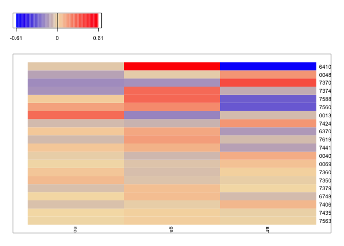

This plot is featured in **Figure 6A**

Phenotype changes
-----------------

We can do the same for phenotype: Here samples 6450, 7363 and 7362 are omitted due to technical issues

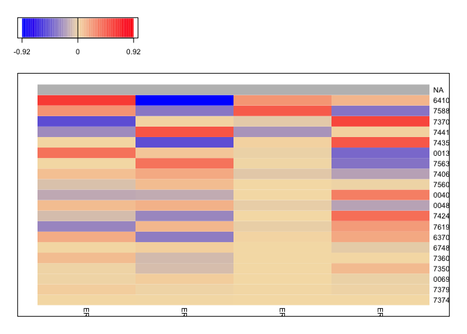

Geno-Phenotype changes
----------------------

We can do the same for phenotype: Here samples 6450, 7363 and 7362 are omitted due to technical issues

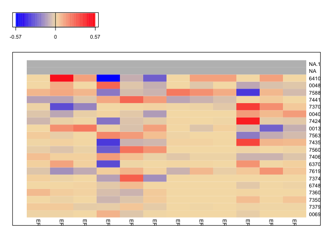

KM curves based on genotype or phenotype changes
------------------------------------------------

Does the KL index associate with patient outcome? Here, we discretise patients based on the median value and determine whether this associates with OS or DFS:

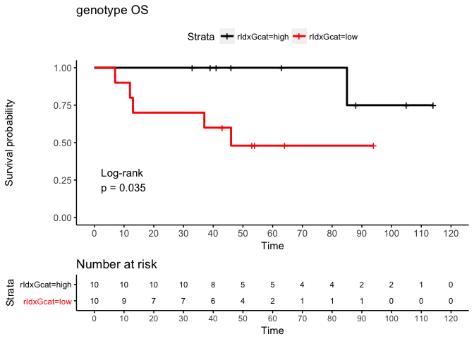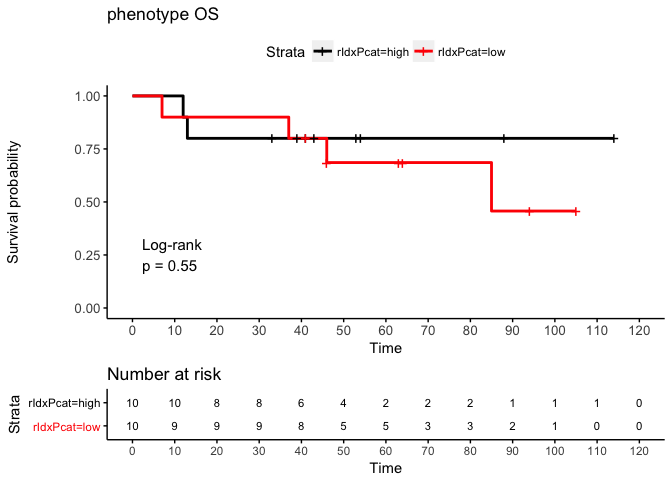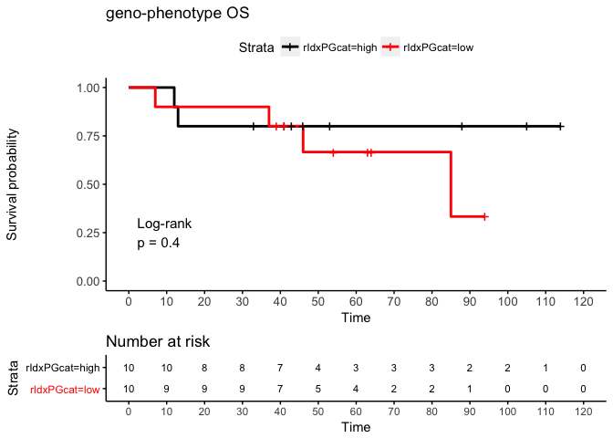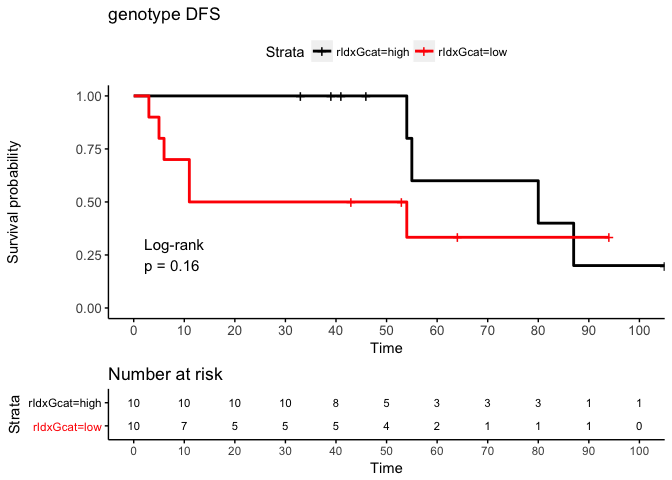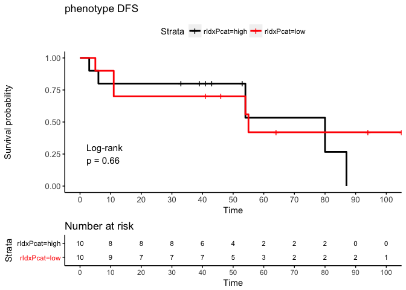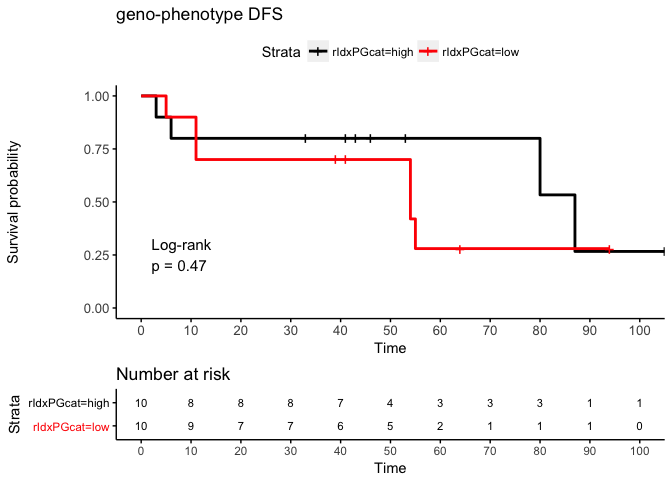

This is featured in **Figure 6B**

Associating differences in KL with other clinicopathological parameters
-----------------------------------------------------------------------

    ##                                ERpos                              ERpcCut 
    ##                            1.0000000                            0.5180671 
    ##                              PgR_IHC                             HER2.IHC 
    ##                            0.6499166                            1.0000000 
    ##                                Grade                                Stage 
    ##                            0.3698500                            0.3034056 
    ##                            histology                 neoadjuvant.response 
    ##                            0.4736842                            0.3730650 
    ##                   Distant.Metastases Status.at.the.time.of.last.follow.up 
    ##                            0.6562818                            0.1408669 
    ##                              ampType                           clustPhenO 
    ##                            1.0000000                            1.0000000 
    ##                             clustGen                              clustPG 
    ##                            0.4498690                            1.0000000 
    ##                                LKMet 
    ##                            0.1698023

None of the above clinicopathological parametrs are associated with genetic KL index

Trajectory for metastatic samples:
==================================

The patients 7435 and 7360 go on to later metastasise. We can follow the changes in the cellular composition of their tumours:

Patient 7435
------------

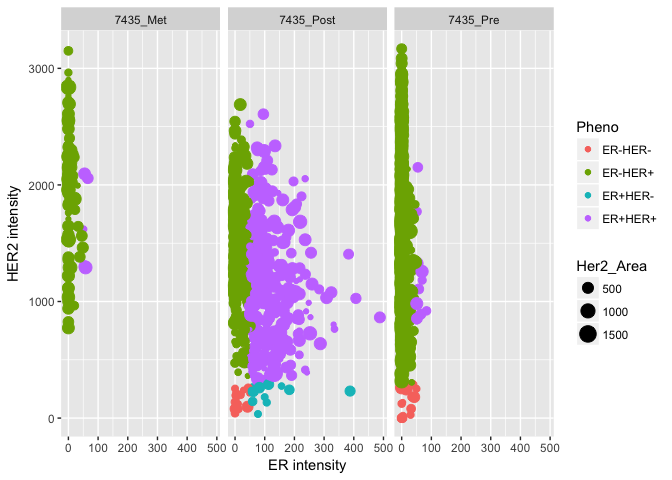

We see that this patient goes from having a primarily HER2+ER- to a diverse mixture after treatment. However, the metastatic sample appears to be more similar to the primary sample (or in fact, is enriched for HER2+ cells)

We can also check the amplicon type for this patient and see how it changes: 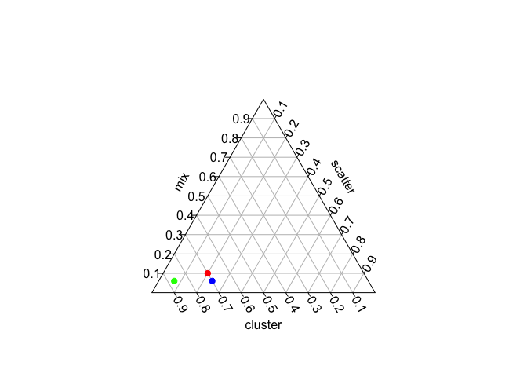

Patient 7360
------------

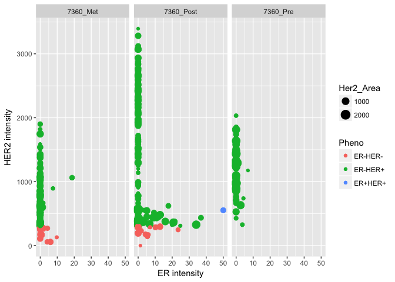

In contrast, patient 7360 doesn't show much difference in phenotype in its evolutionary trajectory

We can also check the amplicon type for this patient and see how it changes: 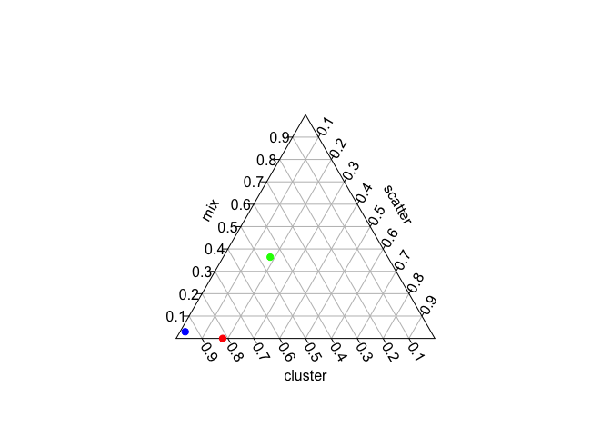

R Session Info
==============

    ## R version 3.4.3 (2017-11-30)
    ## Platform: x86_64-apple-darwin15.6.0 (64-bit)
    ## Running under: macOS High Sierra 10.13.2
    ## 
    ## Matrix products: default
    ## BLAS: /Library/Frameworks/R.framework/Versions/3.4/Resources/lib/libRblas.0.dylib
    ## LAPACK: /Library/Frameworks/R.framework/Versions/3.4/Resources/lib/libRlapack.dylib
    ## 
    ## locale:
    ## [1] en_US.UTF-8/en_US.UTF-8/en_US.UTF-8/C/en_US.UTF-8/en_US.UTF-8
    ## 
    ## attached base packages:
    ## [1] parallel  stats     graphics  grDevices utils     datasets  methods  
    ## [8] base     
    ## 
    ## other attached packages:
    ##  [1] survminer_0.4.1    ggpubr_0.1.6       magrittr_1.5      
    ##  [4] plotrix_3.7        ggrepel_0.7.0      survival_2.41-3   
    ##  [7] doParallel_1.0.11  iterators_1.0.9    foreach_1.4.4     
    ## [10] gclus_1.3.1        cluster_2.0.6      plyr_1.8.4        
    ## [13] reshape2_1.4.3     RColorBrewer_1.1-2 gplots_3.0.1      
    ## [16] ggplot2_2.2.1     
    ## 
    ## loaded via a namespace (and not attached):
    ##  [1] gtools_3.5.0        zoo_1.8-1           purrr_0.2.4        
    ##  [4] splines_3.4.3       lattice_0.20-35     colorspace_1.3-2   
    ##  [7] htmltools_0.3.6     yaml_2.1.16         survMisc_0.5.4     
    ## [10] rlang_0.1.6         pillar_1.0.1        foreign_0.8-69     
    ## [13] glue_1.2.0          bindrcpp_0.2        bindr_0.1          
    ## [16] stringr_1.2.0       munsell_0.4.3       gtable_0.2.0       
    ## [19] caTools_1.17.1      codetools_0.2-15    psych_1.7.8        
    ## [22] evaluate_0.10.1     labeling_0.3        knitr_1.18         
    ## [25] broom_0.4.3         Rcpp_0.12.14        xtable_1.8-2       
    ## [28] KernSmooth_2.23-15  scales_0.5.0        backports_1.1.2    
    ## [31] gdata_2.18.0        cmprsk_2.2-7        km.ci_0.5-2        
    ## [34] gridExtra_2.3       mnormt_1.5-5        digest_0.6.13      
    ## [37] stringi_1.1.6       dplyr_0.7.4         KMsurv_0.1-5       
    ## [40] grid_3.4.3          rprojroot_1.3-1     tools_3.4.3        
    ## [43] bitops_1.0-6        lazyeval_0.2.1      tibble_1.4.1       
    ## [46] tidyr_0.7.2         pkgconfig_2.0.1     Matrix_1.2-12      
    ## [49] data.table_1.10.4-3 assertthat_0.2.0    rmarkdown_1.8      
    ## [52] R6_2.2.2            nlme_3.1-131        compiler_3.4.3
